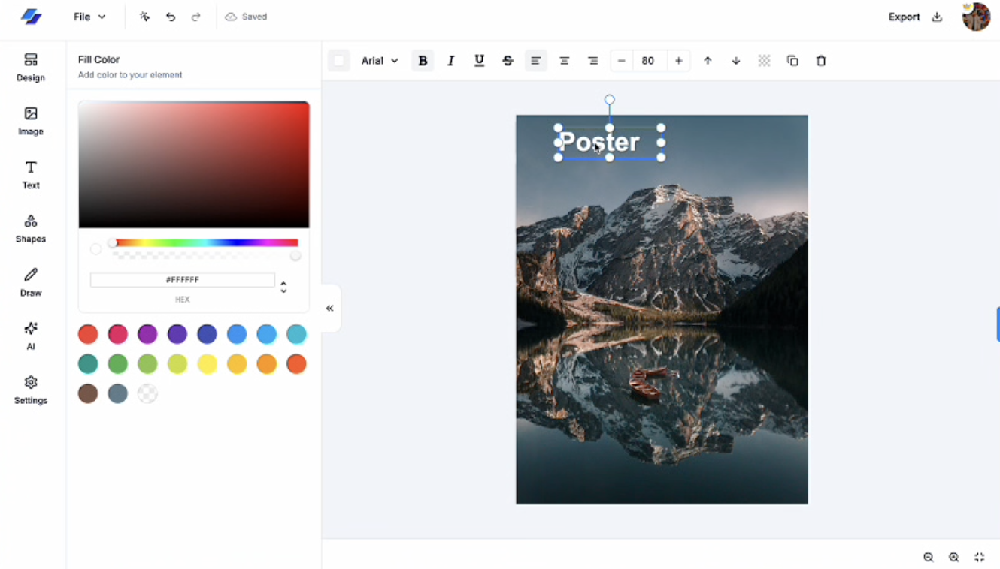

<p align="center">
  
</p>

<h1 align="center">DesignAI</h1>

<p align="center">
  A full-stack, AI-powered design editor built with Next.js 14, Fabric.js, and Replicate AI
</p>

<p align="center">
  Next.js 14 &nbsp;&middot;&nbsp; TypeScript &nbsp;&middot;&nbsp; Fabric.js &nbsp;&middot;&nbsp; Stripe &nbsp;&middot;&nbsp; AI-Powered &nbsp;&middot;&nbsp;
</p>

<br />

<p align="center">
  
</p>

<!-- Uncomment and replace with your deployed URL -->
<!-- <p align="center">
  <a href="https://your-demo-url.vercel.app"><strong>View Live Demo &rarr;</strong></a>
</p> -->

---

## Table of Contents

- [Features](#features)
- [Tech Stack](#tech-stack)
- [Architecture](#architecture)
- [Project Structure](#project-structure)
- [Key Technical Highlights](#key-technical-highlights)
- [Getting Started](#getting-started)
- [Environment Variables](#environment-variables)
- [API Routes](#api-routes)
- [Keyboard Shortcuts](#keyboard-shortcuts)
- [Acknowledgments](#acknowledgments)
- [License](#license)

---

## Features

### Canvas & Design Editor

- **Shape Tools** — Circle, rectangle, soft rectangle (rounded), triangle, inverse triangle, and diamond with customizable fill, stroke, and dash patterns
- **Rich Text Editing** — 18 font families, adjustable font size and weight, bold, italic, underline, strikethrough, and text alignment (left/center/right)
- **Freehand Drawing** — Brush-based drawing mode with adjustable brush width and color
- **23 Image Filters** — Polaroid, sepia, kodachrome, vintage, technicolor, brownie, blur, sharpen, emboss, pixelate, contrast, brightness, greyscale, invert, vibrance, hue rotate, saturation, gamma, blend color, remove color, black & white, and resize
- **Color Picker** — Full RGBA color picker with alpha channel support and a 19-color Material Design preset palette
- **Layer Management** — Bring forward and send backward controls for precise object stacking
- **Context-Aware Toolbar** — Dynamically renders relevant controls based on the selected object type (text, shape, or image)

### AI-Powered Features

- **Text-to-Image Generation** — Generate images from text prompts using Stability AI's Stable Diffusion 3 via Replicate
- **AI Background Removal** — Automatically remove image backgrounds using the rembg model via Replicate
- **Premium Gating** — AI features are gated behind a subscription paywall with Stripe integration

### Project Management

- **Full CRUD** — Create, read, update, and delete design projects
- **Project Duplication** — One-click cloning of existing projects
- **Template System** — Browse and load pre-built design templates with pro/free differentiation
- **Auto-Save** — Debounced (500ms) automatic saving with a real-time cloud status indicator (saving/saved/error)

### Export & Import

- **PNG** — Export for web sharing
- **JPG** — Export for printing
- **SVG** — Export for vector editing software
- **JSON** — Save and restore full design state for later editing

### User Experience

- **Undo/Redo** — Full history stack with canvas state serialization
- **Copy/Paste** — Clone objects with smart offset positioning (+10px)
- **Keyboard Shortcuts** — 7 shortcuts for common actions (see [Keyboard Shortcuts](#keyboard-shortcuts))
- **Responsive Canvas** — Auto-resizing canvas with ResizeObserver and viewport transforms
- **Unsplash Integration** — Search and insert free stock images directly from the editor

### Authentication & Payments

- **Multi-Provider Auth** — NextAuth v5 with credentials (bcrypt), GitHub OAuth, and Google OAuth
- **Stripe Subscriptions** — Checkout flow, webhook event handling, billing portal, and subscription status tracking
- **Protected Routes** — Server-side auth validation with JWT session strategy

---

## Tech Stack

| Category | Technology | Purpose |
|:---------|:-----------|:--------|
| **Framework** | Next.js 14 (App Router) | Full-stack React framework with server components |
| **Language** | TypeScript 5 | End-to-end type safety |
| **Canvas** | Fabric.js 5.3 | Interactive canvas manipulation and rendering |
| **Styling** | Tailwind CSS 3.4 | Utility-first CSS framework |
| **UI Components** | Radix UI + shadcn/ui | Accessible, composable component primitives |
| **API** | Hono.js | Lightweight, type-safe HTTP framework |
| **Database** | PostgreSQL (Neon) | Serverless PostgreSQL database |
| **ORM** | Drizzle ORM | Type-safe SQL query builder with migrations |
| **Authentication** | NextAuth v5 | Multi-provider authentication framework |
| **AI** | Replicate (SD3 + rembg) | AI image generation and background removal |
| **Payments** | Stripe | Subscription billing and payment processing |
| **Client State** | Zustand | Lightweight client-side state management |
| **Server State** | TanStack React Query | Asynchronous data fetching and caching |
| **File Upload** | UploadThing | File upload with CDN delivery |
| **Stock Images** | Unsplash API | Free high-resolution image library |
| **Validation** | Zod + drizzle-zod | Runtime schema validation |
| **Notifications** | Sonner | Toast notification system |

---

## Architecture

```
┌─────────────────────────────────────────────────────────────────┐
│                        React Client                             │
│                    (Fabric.js Canvas)                            │
└──────┬──────────────────┬───────────────────┬───────────────────┘
       │                  │                   │
       │ REST + RPC       │ OAuth + Creds     │ Direct Upload
       ▼                  ▼                   ▼
┌──────────────┐  ┌──────────────┐   ┌────────────────┐
│  Hono API    │  │  NextAuth v5 │   │  UploadThing   │
│  Routes      │  │  (JWT)       │   │  (File CDN)    │
└──┬───┬───┬───┘  └──────┬───────┘   └────────────────┘
   │   │   │             │
   │   │   │             │ User Sessions
   │   │   │             ▼
   │   │   │      ┌──────────────┐
   │   │   └─────►│    Neon      │
   │   │          │  PostgreSQL  │
   │   │          │ (Drizzle ORM)│
   │   │          └──────────────┘
   │   │
   │   │  Image Generation    ┌──────────────┐
   │   └─────────────────────►│ Replicate AI │
   │                          │ (SD3 + rembg)│
   │                          └──────────────┘
   │
   │  Checkout + Webhooks     ┌──────────────┐
   ├─────────────────────────►│   Stripe     │
   │                          │(Subscriptions)│
   │                          └──────────────┘
   │
   │  Image Search            ┌──────────────┐
   └─────────────────────────►│  Unsplash    │
                              │ (Stock Images)│
                              └──────────────┘
```

---

## Project Structure

```
src/
├── app/                        # Next.js App Router
│   ├── (auth)/                 # Auth pages (sign-in, sign-up)
│   ├── (dashboard)/            # Dashboard (projects, templates, navbar)
│   ├── editor/[projectId]/     # Dynamic editor page
│   └── api/                    # API layer
│       ├── [[...route]]/       # Hono API (projects, ai, images, subscriptions, users)
│       ├── auth/               # NextAuth route handler
│       └── uploadthing/        # File upload endpoint
│
├── features/                   # Feature-based modules
│   ├── editor/                 # Core editor (20+ components, 8 hooks)
│   │   ├── components/         # Canvas, toolbar, sidebars, color picker
│   │   ├── hooks/              # useEditor, useHistory, useClipboard, useHotkeys,
│   │   │                       # useAutoResize, useCanvasEvents, useLoadState,
│   │   │                       # useWindowEvents
│   │   ├── types.ts            # Editor interface, shape options, filter/font lists
│   │   └── utils.ts            # Download, filter creation, text transforms
│   ├── auth/                   # Auth components (sign-in/up cards, user button)
│   ├── projects/               # Project CRUD API hooks
│   ├── images/                 # Unsplash image fetching
│   ├── ai/                     # AI generation & background removal hooks
│   └── subscriptions/          # Stripe subscription logic, modals, paywall hook
│
├── components/                 # Shared components
│   └── ui/                     # shadcn/ui primitives (button, dialog, input, etc.)
│
├── db/                         # Database layer
│   ├── schema.ts               # Drizzle schema (6 tables with relations)
│   └── drizzle.ts              # Database client initialization
│
├── lib/                        # Service clients
│   ├── hono.ts                 # Hono RPC client
│   ├── stripe.ts               # Stripe client
│   ├── replicate.ts            # Replicate AI client
│   ├── unsplash.ts             # Unsplash API client
│   └── utils.ts                # Utility helpers (cn)
│
├── hooks/                      # Global hooks (useConfirm)
├── auth.ts                     # NextAuth initialization
├── auth.config.ts              # Auth provider configuration
└── middleware.ts               # Route protection middleware
```

---

## Key Technical Highlights

1. **Custom Editor Hook Architecture** — `useEditor` orchestrates 6 specialized sub-hooks (`useHistory`, `useCanvasEvents`, `useClipboard`, `useAutoResize`, `useHotkeys`, `useWindowEvents`) into a unified editor lifecycle

2. **Builder Pattern for Editor Construction** — `buildEditor()` constructs an `Editor` interface exposing 40+ methods for canvas operations, enabling clean separation between state management and UI rendering

3. **Type-Safe API Layer** — Hono RPC routes with Zod schema validation on every request/response, providing end-to-end type safety from client to database

4. **Debounced Auto-Save with Status Feedback** — 500ms debounced mutations via React Query with a real-time cloud status indicator that reflects saving, saved, and error states

5. **Responsive Canvas with Viewport Transforms** — ResizeObserver-based auto-resize hook that recalculates Fabric.js viewport transforms to maintain zoom-to-fit behavior across window sizes

6. **Full Undo/Redo State Machine** — Canvas state serialization into a history stack with skip-save guards that prevent duplicate entries during history traversal

7. **Context-Aware Dynamic Toolbar** — Runtime type discrimination renders different control sets based on the selected object type — text controls for text, filters for images, stroke options for shapes

8. **Stripe Webhook Lifecycle Management** — Complete subscription flow with checkout session creation, webhook signature verification, subscription status persistence, and billing portal integration

9. **Feature-Based Modular Architecture** — Domain-driven organization where each feature (editor, auth, projects, AI, subscriptions) is self-contained with its own components, hooks, and API layer

10. **Multi-Provider Authentication** — NextAuth v5 beta with credentials (bcrypt password hashing), GitHub OAuth, and Google OAuth using JWT session strategy and Drizzle adapter for database persistence

---

## Getting Started

### Prerequisites

- Node.js 18+
- npm (or yarn/pnpm)
- PostgreSQL database ([Neon](https://neon.tech) recommended for serverless)

### Installation

```bash
# Clone the repository
git clone https://github.com/your-username/design-ai.git
cd design-ai

# Install dependencies
npm install

# Set up environment variables
cp .env.example .env.local
# Fill in all required values (see Environment Variables below)

# Generate and run database migrations
npm run db:generate
npm run db:migrate

# Start the development server
npm run dev
```

Open [http://localhost:3000](http://localhost:3000) to access the application.

### Available Scripts

| Command | Description |
|:--------|:------------|
| `npm run dev` | Start development server |
| `npm run build` | Build for production |
| `npm run start` | Start production server |
| `npm run lint` | Run ESLint |
| `npm run db:generate` | Generate database migrations |
| `npm run db:migrate` | Run database migrations |
| `npm run db:studio` | Open Drizzle Studio (database GUI) |

---

## Environment Variables

Create a `.env.local` file in the project root with the following variables:

| Variable | Description | Source |
|:---------|:------------|:-------|
| `DATABASE_URL` | Neon PostgreSQL connection string | [neon.tech](https://neon.tech) |
| `AUTH_SECRET` | NextAuth encryption secret | `openssl rand -base64 32` |
| `GITHUB_CLIENT_ID` | GitHub OAuth application ID | [GitHub Developer Settings](https://github.com/settings/developers) |
| `GITHUB_CLIENT_SECRET` | GitHub OAuth application secret | [GitHub Developer Settings](https://github.com/settings/developers) |
| `GOOGLE_CLIENT_ID` | Google OAuth client ID | [Google Cloud Console](https://console.cloud.google.com) |
| `GOOGLE_CLIENT_SECRET` | Google OAuth client secret | [Google Cloud Console](https://console.cloud.google.com) |
| `REPLICATE_API_TOKEN` | Replicate API token for AI features | [replicate.com](https://replicate.com) |
| `NEXT_PUBLIC_UNSPLASH_ACCESS_KEY` | Unsplash API access key | [unsplash.com/developers](https://unsplash.com/developers) |
| `UPLOADTHING_SECRET` | UploadThing secret key | [uploadthing.com](https://uploadthing.com) |
| `UPLOADTHING_APP_ID` | UploadThing application ID | [uploadthing.com](https://uploadthing.com) |
| `STRIPE_SECRET_KEY` | Stripe secret API key | [Stripe Dashboard](https://dashboard.stripe.com) |
| `STRIPE_WEBHOOK_SECRET` | Stripe webhook signing secret | Stripe Dashboard > Webhooks |
| `STRIPE_PRICE_ID` | Stripe price ID for subscription plan | Stripe Dashboard > Products |
| `NEXT_PUBLIC_APP_URL` | Application base URL | e.g., `http://localhost:3000` |

---

## API Routes

| Method | Endpoint | Description | Auth |
|:-------|:---------|:------------|:-----|
| `POST` | `/api/projects` | Create a new project | Required |
| `GET` | `/api/projects` | List user projects (paginated) | Required |
| `GET` | `/api/projects/:id` | Get a single project | Required |
| `PATCH` | `/api/projects/:id` | Update a project | Required |
| `DELETE` | `/api/projects/:id` | Delete a project | Required |
| `POST` | `/api/projects/:id/duplicate` | Duplicate a project | Required |
| `GET` | `/api/projects/templates` | List design templates (paginated) | Required |
| `POST` | `/api/ai/generate-image` | Generate an image from a text prompt | Required |
| `POST` | `/api/ai/remove-bg` | Remove background from an image | Required |
| `GET` | `/api/images` | Search Unsplash images | Required |
| `POST` | `/api/subscriptions/checkout` | Create a Stripe checkout session | Required |
| `POST` | `/api/subscriptions/billing` | Open the Stripe billing portal | Required |
| `GET` | `/api/subscriptions/current` | Get current subscription status | Required |

---

## Keyboard Shortcuts

| Shortcut | Action |
|:---------|:-------|
| `Ctrl/Cmd + Z` | Undo |
| `Ctrl/Cmd + Y` | Redo |
| `Ctrl/Cmd + C` | Copy selected objects |
| `Ctrl/Cmd + V` | Paste copied objects |
| `Ctrl/Cmd + S` | Save project |
| `Ctrl/Cmd + A` | Select all objects |
| `Backspace` | Delete selected objects |

---

## Acknowledgments

- [Fabric.js](http://fabricjs.com/) — Powerful HTML5 canvas library
- [Replicate](https://replicate.com/) — AI model hosting and inference
- [Neon](https://neon.tech/) — Serverless PostgreSQL
- [shadcn/ui](https://ui.shadcn.com/) — Beautifully designed UI components
- [Radix UI](https://www.radix-ui.com/) — Accessible component primitives
- [Unsplash](https://unsplash.com/) — Free high-resolution images

---

## License

This project is licensed under the MIT License. See the [LICENSE](LICENSE) file for details.
